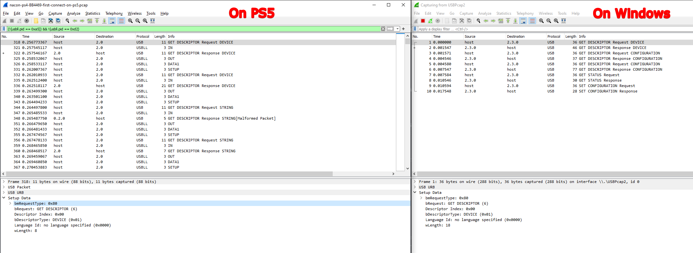

# NACON PS4 Compact Controller BB4469Blk

## Highlights

When connected to a Windows PC it represents itself as an XUSB-compatible Xbox 360 Controller. By default, it manages to stall/freeze tools like USB Tree View and Wireshark/USBPcap due to some jet unidentified firmware problem.

We're basically trying to figure out if we can use this controller in "PS4 mode" on PC instead of XUSB (which it currently represents itself) to get all features like touch inputs etc. to feed it into DS4Windows or similar tools.

My particular model can be switched to WinUSB using [Identinator](https://github.com/nefarius/Identinator) and the `winusb.reg` file in this folder. It will not work via GUI due to a bug.

## "Updater" mode

When `Share` and `Options` buttons are kept pressed simultaneously while plugging it into a PC, the pad seems to switch into some sort of firmware flash mode? The device name changes to "Updater" and uses IDs VID `0x2f24` and PID `0x0001`.

### Wireshark

```text
Frame 2: 46 bytes on wire (368 bits), 46 bytes captured (368 bits) on interface \\.\USBPcap2, id 0
USB URB
DEVICE DESCRIPTOR
    bLength: 18
    bDescriptorType: 0x01 (DEVICE)
    bcdUSB: 0x0110
    bDeviceClass: Device (0x00)
    bDeviceSubClass: 0
    bDeviceProtocol: 0 (Use class code info from Interface Descriptors)
    bMaxPacketSize0: 64
    idVendor: Unknown (0x2f24)
    idProduct: Unknown (0x0001)
    bcdDevice: 0x0120
    iManufacturer: 1
    iProduct: 2
    iSerialNumber: 0
    bNumConfigurations: 1

Frame 4: 37 bytes on wire (296 bits), 37 bytes captured (296 bits) on interface \\.\USBPcap2, id 0
USB URB
CONFIGURATION DESCRIPTOR
    bLength: 9
    bDescriptorType: 0x02 (CONFIGURATION)
    wTotalLength: 34
    bNumInterfaces: 1
    bConfigurationValue: 1
    iConfiguration: 0
    Configuration bmAttributes: 0x80  NOT SELF-POWERED  NO REMOTE-WAKEUP
    bMaxPower: 50  (100mA)

Frame 6: 62 bytes on wire (496 bits), 62 bytes captured (496 bits) on interface \\.\USBPcap2, id 0
USB URB
CONFIGURATION DESCRIPTOR
    bLength: 9
    bDescriptorType: 0x02 (CONFIGURATION)
    wTotalLength: 34
    bNumInterfaces: 1
    bConfigurationValue: 1
    iConfiguration: 0
    Configuration bmAttributes: 0x80  NOT SELF-POWERED  NO REMOTE-WAKEUP
    bMaxPower: 50  (100mA)
INTERFACE DESCRIPTOR (0.0): class HID
    bLength: 9
    bDescriptorType: 0x04 (INTERFACE)
    bInterfaceNumber: 0
    bAlternateSetting: 0
    bNumEndpoints: 1
    bInterfaceClass: HID (0x03)
    bInterfaceSubClass: No Subclass (0x00)
    bInterfaceProtocol: 0x00
    iInterface: 0
UNKNOWN DESCRIPTOR
    bLength: 9
    bDescriptorType: 0x21 (unknown)
ENDPOINT DESCRIPTOR
    bLength: 7
    bDescriptorType: 0x05 (ENDPOINT)
    bEndpointAddress: 0x81  IN  Endpoint:1
    bmAttributes: 0x03
    wMaxPacketSize: 32
    bInterval: 32

Frame 9: 36 bytes on wire (288 bits), 36 bytes captured (288 bits) on interface \\.\USBPcap2, id 0
USB URB
Setup Data
    bmRequestType: 0x21
    bRequest: 10
    wValue: 0x0000
    wIndex: 0 (0x0000)
    wLength: 0

Frame 11: 36 bytes on wire (288 bits), 36 bytes captured (288 bits) on interface \\.\USBPcap2, id 0
USB URB
Setup Data
    bmRequestType: 0x81
    bRequest: 6
    wValue: 0x2200
    wIndex: 0 (0x0000)
    wLength: 100

Frame 12: 64 bytes on wire (512 bits), 64 bytes captured (512 bits) on interface \\.\USBPcap2, id 0
USB URB
CONTROL response data: 0600ff0901a10119012902150025017501960001810219012902150025019600029102c0

```

### UsbTreeView

```text
    =========================== USB Port5 ===========================

Connection Status        : 0x01 (Device is connected)
Port Chain               : 4-5
Properties               : 0x01
 IsUserConnectable       : yes
 PortIsDebugCapable      : no
 PortHasMultiCompanions  : no
 PortConnectorIsTypeC    : no

      ======================== USB Device ========================

        +++++++++++++++++ Device Information ++++++++++++++++++
Device Description       : USB Input Device
Device Path              : \\?\usb#vid_2f24&pid_0001#8&1265ce96&0&5#{a5dcbf10-6530-11d2-901f-00c04fb951ed}
Device ID                : USB\VID_2F24&PID_0001\8&1265CE96&0&5
Hardware IDs             : USB\VID_2F24&PID_0001&REV_0120 USB\VID_2F24&PID_0001
Driver KeyName           : {745a17a0-74d3-11d0-b6fe-00a0c90f57da}\0085 (GUID_DEVCLASS_HIDCLASS)
Driver                   : \SystemRoot\System32\drivers\hidusb.sys (Version: 10.0.19041.868  Date: 2021-04-18)
Driver Inf               : C:\WINDOWS\inf\input.inf
Legacy BusType           : PNPBus
Class                    : HIDClass
Class GUID               : {745a17a0-74d3-11d0-b6fe-00a0c90f57da} (GUID_DEVCLASS_HIDCLASS)
Interface GUID           : {a5dcbf10-6530-11d2-901f-00c04fb951ed} (GUID_DEVINTERFACE_USB_DEVICE)
Service                  : HidUsb
Enumerator               : USB
Location Info            : Port_#0005.Hub_#0002
Location IDs             : PCIROOT(0)#PCI(0102)#PCI(0000)#PCI(0800)#PCI(0003)#USBROOT(0)#USB(5), ACPI(_SB_)#ACPI(PCI0)#ACPI(BXBR)#ACPI(BYUP)#ACPI(BYD8)#ACPI(XHC0)#ACPI(RHUB)#ACPI(PRT5)
Container ID             : {7180b222-4188-11ed-9452-fd82f29fe66d}
Manufacturer Info        : (Standard system devices)
Capabilities             : 0x84 (Removable, SurpriseRemovalOK)
Status                   : 0x0180600A (DN_DRIVER_LOADED, DN_STARTED, DN_DISABLEABLE, DN_REMOVABLE, DN_NT_ENUMERATOR, DN_NT_DRIVER)
Problem Code             : 0
EnhancedPowerMgmtEnabled : 1
Power State              : D0 (supported: D0, D3, wake from D0)
 Child Device 1          : HID-compliant vendor-defined device
  DevicePath             : \\?\hid#vid_2f24&pid_0001#9&119e0d87&0&0000#{4d1e55b2-f16f-11cf-88cb-001111000030}
  KernelName             : \Device\000001c3
  Device ID              : HID\VID_2F24&PID_0001\9&119E0D87&0&0000
  Class                  : HIDClass

        ---------------- Connection Information ---------------
Connection Index         : 0x05 (5)
Connection Status        : 0x01 (DeviceConnected)
Current Config Value     : 0x01
Device Address           : 0x07 (7)
Is Hub                   : 0x00 (no)
Device Bus Speed         : 0x01 (Full-Speed)
Number Of Open Pipes     : 0x01 (1 pipe to data endpoints)
Pipe[0]                  : EndpointID=1  Direction=IN   ScheduleOffset=0  Type=Interrupt
Data (HexDump)           : 05 00 00 00 12 01 10 01 00 00 00 40 24 2F 01 00   ...........@$/..
                           20 01 01 02 00 01 01 01 00 07 00 01 00 00 00 01    ...............
                           00 00 00 07 05 81 03 20 00 20 00 00 00 00         ....... . ....

        --------------- Connection Information V2 -------------
Connection Index         : 0x05 (5)
Length                   : 0x10 (16 bytes)
SupportedUsbProtocols    : 0x03
 Usb110                  : 1 (yes)
 Usb200                  : 1 (yes)
 Usb300                  : 0 (no)
 ReservedMBZ             : 0x00
Flags                    : 0x00
 DevIsOpAtSsOrHigher     : 0 (Is not operating at SuperSpeed or higher)
 DevIsSsCapOrHigher      : 0 (Is not SuperSpeed capable or higher)
 DevIsOpAtSsPlusOrHigher : 0 (Is not operating at SuperSpeedPlus or higher)
 DevIsSsPlusCapOrHigher  : 0 (Is not SuperSpeedPlus capable or higher)
 ReservedMBZ             : 0x00
Data (HexDump)           : 05 00 00 00 10 00 00 00 03 00 00 00 00 00 00 00   ................

    ---------------------- Device Descriptor ----------------------
bLength                  : 0x12 (18 bytes)
bDescriptorType          : 0x01 (Device Descriptor)
bcdUSB                   : 0x110 (USB Version 1.10)
bDeviceClass             : 0x00 (defined by the interface descriptors)
bDeviceSubClass          : 0x00
bDeviceProtocol          : 0x00
bMaxPacketSize0          : 0x40 (64 bytes)
idVendor                 : 0x2F24
idProduct                : 0x0001
bcdDevice                : 0x0120
iManufacturer            : 0x01 (String Descriptor 1)
 Language 0x0409         : " "
iProduct                 : 0x02 (String Descriptor 2)
 Language 0x0409         : "Updater"
iSerialNumber            : 0x00 (No String Descriptor)
bNumConfigurations       : 0x01 (1 Configuration)
Data (HexDump)           : 12 01 10 01 00 00 00 40 24 2F 01 00 20 01 01 02   .......@$/.. ...
                           00 01                                             ..

    ------------------ Configuration Descriptor -------------------
bLength                  : 0x09 (9 bytes)
bDescriptorType          : 0x02 (Configuration Descriptor)
wTotalLength             : 0x0022 (34 bytes)
bNumInterfaces           : 0x01 (1 Interface)
bConfigurationValue      : 0x01 (Configuration 1)
iConfiguration           : 0x00 (No String Descriptor)
bmAttributes             : 0x80
 D7: Reserved, set 1     : 0x01
 D6: Self Powered        : 0x00 (no)
 D5: Remote Wakeup       : 0x00 (no)
 D4..0: Reserved, set 0  : 0x00
MaxPower                 : 0x32 (100 mA)
Data (HexDump)           : 09 02 22 00 01 01 00 80 32 09 04 00 00 01 03 00   ..".....2.......
                           00 00 09 21 11 01 00 01 22 24 00 07 05 81 03 20   ...!...."$..... 
                           00 20                                             . 

        ---------------- Interface Descriptor -----------------
bLength                  : 0x09 (9 bytes)
bDescriptorType          : 0x04 (Interface Descriptor)
bInterfaceNumber         : 0x00
bAlternateSetting        : 0x00
bNumEndpoints            : 0x01 (1 Endpoint)
bInterfaceClass          : 0x03 (HID - Human Interface Device)
bInterfaceSubClass       : 0x00 (None)
bInterfaceProtocol       : 0x00 (None)
iInterface               : 0x00 (No String Descriptor)
Data (HexDump)           : 09 04 00 00 01 03 00 00 00                        .........

        ------------------- HID Descriptor --------------------
bLength                  : 0x09 (9 bytes)
bDescriptorType          : 0x21 (HID Descriptor)
bcdHID                   : 0x0111 (HID Version 1.11)
bCountryCode             : 0x00 (00 = not localized)
bNumDescriptors          : 0x01
Data (HexDump)           : 09 21 11 01 00 01 22 24 00                        .!...."$.
Descriptor 1:
bDescriptorType          : 0x22 (Class=Report)
wDescriptorLength        : 0x0024 (36 bytes)
Error reading descriptor : ERROR_INVALID_PARAMETER

        ----------------- Endpoint Descriptor -----------------
bLength                  : 0x07 (7 bytes)
bDescriptorType          : 0x05 (Endpoint Descriptor)
bEndpointAddress         : 0x81 (Direction=IN EndpointID=1)
bmAttributes             : 0x03 (TransferType=Interrupt)
wMaxPacketSize           : 0x0020 (32 bytes)
bInterval                : 0x20 (32 ms)
Data (HexDump)           : 07 05 81 03 20 00 20                              .... . 

      -------------------- String Descriptors -------------------
             ------ String Descriptor 0 ------
bLength                  : 0x04 (4 bytes)
bDescriptorType          : 0x03 (String Descriptor)
Language ID[0]           : 0x0409 (English - United States)
Data (HexDump)           : 04 03 09 04                                       ....
             ------ String Descriptor 1 ------
bLength                  : 0x04 (4 bytes)
bDescriptorType          : 0x03 (String Descriptor)
Language 0x0409          : " "  *!*CAUTION  contains space characters only
Data (HexDump)           : 04 03 20 00                                       .. .
             ------ String Descriptor 2 ------
bLength                  : 0x10 (16 bytes)
bDescriptorType          : 0x03 (String Descriptor)
Language 0x0409          : "Updater"
Data (HexDump)           : 10 03 55 00 70 00 64 00 61 00 74 00 65 00 72 00   ..U.p.d.a.t.e.r.
```

## NACON PS4 Compact Controller BB4469CGry

Connection sequence slightly differs between on PS and on Windows. The PS's first GET_DESCRIPTOR request has an 8 byte length while Windows uses 18 bytes. Another difference observed is that the PS firmware issues a SET_ADDRESS before the first GET_DESCRIPTOR whine on Windows this is the other way around. For now these are assumptions as proofing this is difficult without a custom USB stack.



### UsbTreeView (WinSUB)

```text

    =========================== USB Port10 ===========================

Connection Status        : 0x01 (Device is connected)
Port Chain               : 2-10

      ========================== Summary =========================
Vendor ID                : 0x146B (BigBen Interactive Limited)
Product ID               : 0x0603
USB Version              : 2.0 -> but Device is Full-Speed only
Port maximum Speed       : High-Speed
Device maximum Speed     : Full-Speed
Device Connection Speed  : Full-Speed
Self powered             : no
Demanded Current         : 500 mA
Used Endpoints           : 3

      ======================== USB Device ========================

        +++++++++++++++++ Device Information ++++++++++++++++++
Friendly Name            : PC Compact Controller
Device Description       : WinUsb Device
Device Path 1            : \\?\USB#VID_CEA0&PID_D200#04E028E1#{a5dcbf10-6530-11d2-901f-00c04fb951ed} (GUID_DEVINTERFACE_USB_DEVICE)
Device Path 2            : \\?\USB#VID_CEA0&PID_D200#04E028E1#{86431f5b-9f5a-48ce-8fbf-a537413ef358}
Kernel Name              : \Device\USBPDO-10
Device ID                : USB\VID_CEA0&PID_D200\04E028E1
Hardware IDs             : USB\VID_CEA0&PID_D200
Driver KeyName           : {88bae032-5a81-49f0-bc3d-a4ff138216d6}\0001 (GUID_DEVCLASS_USBDEVICE)
Driver                   : \SystemRoot\System32\drivers\WinUSB.sys (Version: 10.0.19041.1  Date: 2019-12-07)
Driver Inf               : C:\WINDOWS\inf\winusb.inf
Legacy BusType           : PNPBus
Class                    : USBDevice
Class GUID               : {88bae032-5a81-49f0-bc3d-a4ff138216d6} (GUID_DEVCLASS_USBDEVICE)
Service                  : WINUSB
Enumerator               : USB
Location Info            : Port_#0010.Hub_#0001
Location IDs             : PCIROOT(0)#PCI(1400)#USBROOT(0)#USB(10), ACPI(_SB_)#ACPI(PCI0)#ACPI(XHC_)#ACPI(RHUB)#ACPI(HS10)
Container ID             : {a581e49f-cc24-507b-9b10-f90fbae6d1e2}
Manufacturer Info        : WinUsb Device
Capabilities             : 0x14 (Removable, UniqueID)
Status                   : 0x0180600A (DN_DRIVER_LOADED, DN_STARTED, DN_DISABLEABLE, DN_REMOVABLE, DN_NT_ENUMERATOR, DN_NT_DRIVER)
Problem Code             : 0
HcDisableSelectiveSuspend: 0
EnableSelectiveSuspend   : 0
SelectiveSuspendEnabled  : 0
EnhancedPowerMgmtEnabled : 0
IdleInWorkingState       : 0
WakeFromSleepState       : 0
Power State              : D0 (supported: D0, D3, wake from D0)

        +++++++++++++++++ Registry USB Flags +++++++++++++++++
HKEY_LOCAL_MACHINE\SYSTEM\CurrentControlSet\Control\usbflags\146B06030100
 osvc                    : REG_BINARY 01 90
 SkipContainerIdQuery    : REG_BINARY 01 00

        ---------------- Connection Information ---------------
Connection Index         : 0x0A (Port 10)
Connection Status        : 0x01 (DeviceConnected)
Current Config Value     : 0x01 (Configuration 1)
Device Address           : 0x0E (14)
Is Hub                   : 0x00 (no)
Device Bus Speed         : 0x01 (Full-Speed)
Number Of Open Pipes     : 0x02 (2 pipes to data endpoints)
Pipe[0]                  : EndpointID=1  Direction=IN   ScheduleOffset=0  Type=Interrupt  wMaxPacketSize=64    bInterval=4
Pipe[1]                  : EndpointID=2  Direction=OUT  ScheduleOffset=0  Type=Interrupt  wMaxPacketSize=64    bInterval=8
Data (HexDump)           : 0A 00 00 00 12 01 00 02 FF FF FF 40 6B 14 03 06   ...........@k...
                           00 01 01 02 03 01 01 01 00 0E 00 02 00 00 00 01   ................
                           00 00 00 07 05 81 03 40 00 04 00 00 00 00 07 05   .......@........
                           02 03 40 00 08 00 00 00 00                        ..@......

        --------------- Connection Information V2 -------------
Connection Index         : 0x0A (10)
Length                   : 0x10 (16 bytes)
SupportedUsbProtocols    : 0x03
 Usb110                  : 1 (yes, port supports USB 1.1)
 Usb200                  : 1 (yes, port supports USB 2.0)
 Usb300                  : 0 (no, port not supports USB 3.0)
 ReservedMBZ             : 0x00
Flags                    : 0x00
 DevIsOpAtSsOrHigher     : 0 (Device is not operating at SuperSpeed or higher)
 DevIsSsCapOrHigher      : 0 (Device is not SuperSpeed capable or higher)
 DevIsOpAtSsPlusOrHigher : 0 (Device is not operating at SuperSpeedPlus or higher)
 DevIsSsPlusCapOrHigher  : 0 (Device is not SuperSpeedPlus capable or higher)
 ReservedMBZ             : 0x00
Data (HexDump)           : 0A 00 00 00 10 00 00 00 03 00 00 00 00 00 00 00   ................

    ---------------------- Device Descriptor ----------------------
bLength                  : 0x12 (18 bytes)
bDescriptorType          : 0x01 (Device Descriptor)
bcdUSB                   : 0x200 (USB Version 2.0) -> but device is Full-Speed only
bDeviceClass             : 0xFF (Vendor Specific)
bDeviceSubClass          : 0xFF
bDeviceProtocol          : 0xFF
bMaxPacketSize0          : 0x40 (64 bytes)
idVendor                 : 0x146B (BigBen Interactive Limited)
idProduct                : 0x0603
bcdDevice                : 0x0100
iManufacturer            : 0x01 (String Descriptor 1)
 Language 0x0409         : "Bigben Interactive"
iProduct                 : 0x02 (String Descriptor 2)
 Language 0x0409         : "PC Compact Controller"
iSerialNumber            : 0x03 (String Descriptor 3)
 Language 0x0409         : "04E028E1"
bNumConfigurations       : 0x01 (1 Configuration)
Data (HexDump)           : 12 01 00 02 FF FF FF 40 6B 14 03 06 00 01 01 02   .......@k.......
                           03 01                                             ..

    ------------------ Configuration Descriptor -------------------
bLength                  : 0x09 (9 bytes)
bDescriptorType          : 0x02 (Configuration Descriptor)
wTotalLength             : 0x0031 (49 bytes)
bNumInterfaces           : 0x01 (1 Interface)
bConfigurationValue      : 0x01 (Configuration 1)
iConfiguration           : 0x00 (No String Descriptor)
bmAttributes             : 0x80
 D7: Reserved, set 1     : 0x01
 D6: Self Powered        : 0x00 (no)
 D5: Remote Wakeup       : 0x00 (no)
 D4..0: Reserved, set 0  : 0x00
MaxPower                 : 0xFA (500 mA)
Data (HexDump)           : 09 02 31 00 01 01 00 80 FA 09 04 00 00 02 FF 5D   ..1............]
                           01 00 11 21 00 01 01 25 81 14 00 00 00 00 13 02   ...!...%........
                           08 03 03 07 05 81 03 40 00 04 07 05 02 03 40 00   .......@......@.
                           08                                                .

        ---------------- Interface Descriptor -----------------
bLength                  : 0x09 (9 bytes)
bDescriptorType          : 0x04 (Interface Descriptor)
bInterfaceNumber         : 0x00 (Interface 0)
bAlternateSetting        : 0x00
bNumEndpoints            : 0x02 (2 Endpoints)
bInterfaceClass          : 0xFF (Vendor Specific)
bInterfaceSubClass       : 0x5D
bInterfaceProtocol       : 0x01
iInterface               : 0x00 (No String Descriptor)
Data (HexDump)           : 09 04 00 00 02 FF 5D 01 00                        ......]..

        ----------------- Unknown Descriptor ------------------
bLength                  : 0x11 (17 bytes)
bDescriptorType          : 0x21
Data (HexDump)           : 11 21 00 01 01 25 81 14 00 00 00 00 13 02 08 03 
                           03 

        ----------------- Endpoint Descriptor -----------------
bLength                  : 0x07 (7 bytes)
bDescriptorType          : 0x05 (Endpoint Descriptor)
bEndpointAddress         : 0x81 (Direction=IN EndpointID=1)
bmAttributes             : 0x03 (TransferType=Interrupt)
wMaxPacketSize           : 0x0040 (64 bytes)
bInterval                : 0x04 (4 ms)
Data (HexDump)           : 07 05 81 03 40 00 04                              ....@..

        ----------------- Endpoint Descriptor -----------------
bLength                  : 0x07 (7 bytes)
bDescriptorType          : 0x05 (Endpoint Descriptor)
bEndpointAddress         : 0x02 (Direction=OUT EndpointID=2)
bmAttributes             : 0x03 (TransferType=Interrupt)
wMaxPacketSize           : 0x0040 (64 bytes)
bInterval                : 0x08 (8 ms)
Data (HexDump)           : 07 05 02 03 40 00 08                              ....@..

    ----------------- Device Qualifier Descriptor -----------------
Error                    : ERROR_GEN_FAILURE  (because the device is Full-Speed only)

      -------------------- String Descriptors -------------------
             ------ String Descriptor 0 ------
bLength                  : 0x04 (4 bytes)
bDescriptorType          : 0x03 (String Descriptor)
Language ID[0]           : 0x0409 (English - United States)
Data (HexDump)           : 04 03 09 04                                       ....
             ------ String Descriptor 1 ------
bLength                  : 0x26 (38 bytes)
bDescriptorType          : 0x03 (String Descriptor)
Language 0x0409          : "Bigben Interactive"
Data (HexDump)           : 26 03 42 00 69 00 67 00 62 00 65 00 6E 00 20 00   &.B.i.g.b.e.n. .
                           49 00 6E 00 74 00 65 00 72 00 61 00 63 00 74 00   I.n.t.e.r.a.c.t.
                           69 00 76 00 65 00                                 i.v.e.
             ------ String Descriptor 2 ------
bLength                  : 0x2C (44 bytes)
bDescriptorType          : 0x03 (String Descriptor)
Language 0x0409          : "PC Compact Controller"
Data (HexDump)           : 2C 03 50 00 43 00 20 00 43 00 6F 00 6D 00 70 00   ,.P.C. .C.o.m.p.
                           61 00 63 00 74 00 20 00 43 00 6F 00 6E 00 74 00   a.c.t. .C.o.n.t.
                           72 00 6F 00 6C 00 6C 00 65 00 72 00               r.o.l.l.e.r.
             ------ String Descriptor 3 ------
bLength                  : 0x12 (18 bytes)
bDescriptorType          : 0x03 (String Descriptor)
Language 0x0409          : "04E028E1"
Data (HexDump)           : 12 03 30 00 34 00 45 00 30 00 32 00 38 00 45 00   ..0.4.E.0.2.8.E.
                           31 00                                             1.
```

### lsusb

```text
lsusb -vd 146b:0603

Bus 001 Device 004: ID 146b:0603 BigBen Interactive PC Compact Controller
Couldn't open device, some information will be missing
Device Descriptor:
  bLength                18
  bDescriptorType         1
  bcdUSB               2.00
  bDeviceClass          255 Vendor Specific Class
  bDeviceSubClass       255 Vendor Specific Subclass
  bDeviceProtocol       255 Vendor Specific Protocol
  bMaxPacketSize0        64
  idVendor           0x146b BigBen Interactive
  idProduct          0x0603
  bcdDevice            1.00
  iManufacturer           1 Bigben Interactive
  iProduct                2 PC Compact Controller
  iSerial                 3 04E028E1
  bNumConfigurations      1
  Configuration Descriptor:
    bLength                 9
    bDescriptorType         2
    wTotalLength       0x0031
    bNumInterfaces          1
    bConfigurationValue     1
    iConfiguration          0
    bmAttributes         0x80
      (Bus Powered)
    MaxPower              500mA
    Interface Descriptor:
      bLength                 9
      bDescriptorType         4
      bInterfaceNumber        0
      bAlternateSetting       0
      bNumEndpoints           2
      bInterfaceClass       255 Vendor Specific Class
      bInterfaceSubClass     93
      bInterfaceProtocol      1
      iInterface              0
      ** UNRECOGNIZED:  11 21 00 01 01 25 81 14 00 00 00 00 13 02 08 03 03
      Endpoint Descriptor:
        bLength                 7
        bDescriptorType         5
        bEndpointAddress     0x81  EP 1 IN
        bmAttributes            3
          Transfer Type            Interrupt
          Synch Type               None
          Usage Type               Data
        wMaxPacketSize     0x0040  1x 64 bytes
        bInterval               4
      Endpoint Descriptor:
        bLength                 7
        bDescriptorType         5
        bEndpointAddress     0x02  EP 2 OUT
        bmAttributes            3
          Transfer Type            Interrupt
          Synch Type               None
          Usage Type               Data
        wMaxPacketSize     0x0040  1x 64 bytes
        bInterval               8
```
