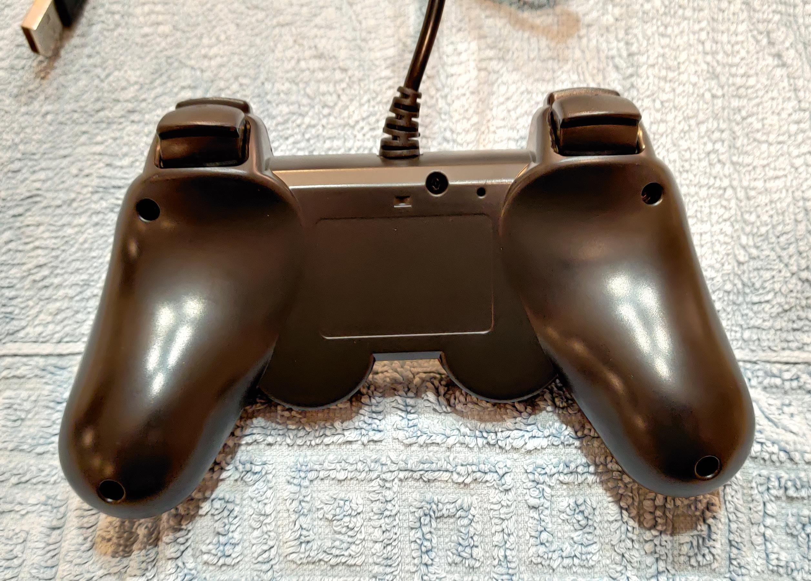

# Retoo Controller PC PS3

- Delivered in bland white box
- Wired only (USB)
- Represented as an Xbox 360 Controller on Windows
- LED behavior
  - Player number when on PS3
  - P2 and P3 are lit on Windows
  - P3 and P4 are lit on Linux/Android

## Pictures

### Front


### Back



## Windows

### USBTreeViewer

```text

    =========================== USB Port6 ===========================

Connection Status        : 0x01 (Device is connected)
Port Chain               : 7-6
Properties               : 0x01
 IsUserConnectable       : yes
 PortIsDebugCapable      : no
 PortHasMultiCompanions  : no
 PortConnectorIsTypeC    : no

      ======================== USB Device ========================

        +++++++++++++++++ Device Information ++++++++++++++++++
Device Description       : Xbox 360 Controller for Windows
Device Path              : \\?\usb#vid_045e&pid_028e#8&1265ce96&0&6#{a5dcbf10-6530-11d2-901f-00c04fb951ed}
Device ID                : USB\VID_045E&PID_028E\8&1265CE96&0&6
Hardware IDs             : USB\VID_045E&PID_028E&REV_0110 USB\VID_045E&PID_028E
Driver KeyName           : {d61ca365-5af4-4486-998b-9db4734c6ca3}\0003 ({D61CA365-5AF4-4486-998B-9DB4734C6CA3})
Driver                   : \SystemRoot\System32\drivers\xusb22.sys (Version: 10.0.19041.4355  Date: 2024-05-15)
Driver Inf               : C:\WINDOWS\inf\xusb22.inf
Legacy BusType           : PNPBus
Class                    : XnaComposite
Class GUID               : {d61ca365-5af4-4486-998b-9db4734c6ca3}
Interface GUID           : {a5dcbf10-6530-11d2-901f-00c04fb951ed} (GUID_DEVINTERFACE_USB_DEVICE)
Service                  : xusb22
Enumerator               : USB
Location Info            : Port_#0006.Hub_#0003
Location IDs             : PCIROOT(0)#PCI(0102)#PCI(0000)#PCI(0800)#PCI(0003)#USBROOT(0)#USB(6), ACPI(_SB_)#ACPI(PCI0)#ACPI(GPP1)#ACPI(BYUP)#ACPI(BYD8)#ACPI(XHC0)#ACPI(RHUB)#ACPI(PRT6)
Container ID             : {6efbab3d-19f0-11ef-9544-cdacaec6af25}
Manufacturer Info        : Microsoft
Capabilities             : 0x84 (Removable, SurpriseRemovalOK)
Status                   : 0x0180600A (DN_DRIVER_LOADED, DN_STARTED, DN_DISABLEABLE, DN_REMOVABLE, DN_NT_ENUMERATOR, DN_NT_DRIVER)
Problem Code             : 0
Power State              : D0 (supported: D0, D1, D2, D3, wake from D0, wake from D1, wake from D2)
 Child Device 1          : USB Input Device
  Device ID              : USB\VID_045E&PID_028E&IG_00\9&3586B5D9&0&00
  Class                  : HIDClass
   Child Device 1        : HID-compliant game controller
    Device ID            : HID\VID_045E&PID_028E&IG_00\A&51A350F&0&0000
    Class                : HIDClass

        +++++++++++++++++ Registry USB Flags +++++++++++++++++
HKEY_LOCAL_MACHINE\SYSTEM\CurrentControlSet\Control\usbflags
 GlobalDisableSerNumGen  : REG_BINARY 00
HKEY_LOCAL_MACHINE\SYSTEM\CurrentControlSet\Control\usbflags\045E028E0110
 osvc                    : REG_BINARY 00 00

        ---------------- Connection Information ---------------
Connection Index         : 0x06 (6)
Connection Status        : 0x01 (DeviceConnected)
Current Config Value     : 0x01
Device Address           : 0x03 (3)
Is Hub                   : 0x00 (no)
Device Bus Speed         : 0x01 (Full-Speed)
Number Of Open Pipes     : 0x02 (2 pipes to data endpoints)
Pipe[0]                  : EndpointID=1  Direction=IN   ScheduleOffset=0  Type=Interrupt
Pipe[1]                  : EndpointID=2  Direction=OUT  ScheduleOffset=0  Type=Interrupt
Data (HexDump)           : 06 00 00 00 12 01 00 02 FF FF FF 40 5E 04 8E 02   ...........@^...
                           10 01 01 02 00 01 01 01 00 03 00 02 00 00 00 01   ................
                           00 00 00 07 05 81 03 20 00 04 00 00 00 00 07 05   ....... ........
                           02 03 20 00 08 00 00 00 00                        .. ......

        --------------- Connection Information V2 -------------
Connection Index         : 0x06 (6)
Length                   : 0x10 (16 bytes)
SupportedUsbProtocols    : 0x03
 Usb110                  : 1 (yes)
 Usb200                  : 1 (yes)
 Usb300                  : 0 (no)
 ReservedMBZ             : 0x00
Flags                    : 0x00
 DevIsOpAtSsOrHigher     : 0 (Is not operating at SuperSpeed or higher)
 DevIsSsCapOrHigher      : 0 (Is not SuperSpeed capable or higher)
 DevIsOpAtSsPlusOrHigher : 0 (Is not operating at SuperSpeedPlus or higher)
 DevIsSsPlusCapOrHigher  : 0 (Is not SuperSpeedPlus capable or higher)
 ReservedMBZ             : 0x00
Data (HexDump)           : 06 00 00 00 10 00 00 00 03 00 00 00 00 00 00 00   ................

    ---------------------- Device Descriptor ----------------------
bLength                  : 0x12 (18 bytes)
bDescriptorType          : 0x01 (Device Descriptor)
bcdUSB                   : 0x200 (USB Version 2.00)
bDeviceClass             : 0xFF (Vendor Specific)
bDeviceSubClass          : 0xFF
bDeviceProtocol          : 0xFF
bMaxPacketSize0          : 0x40 (64 bytes)
idVendor                 : 0x045E (Microsoft Corporation)
idProduct                : 0x028E
bcdDevice                : 0x0110
iManufacturer            : 0x01 (String Descriptor 1)
 Language 0x0409         : "SHANWAN"
iProduct                 : 0x02 (String Descriptor 2)
 Language 0x0409         : "Controller"
iSerialNumber            : 0x00 (No String Descriptor)
bNumConfigurations       : 0x01 (1 Configuration)
Data (HexDump)           : 12 01 00 02 FF FF FF 40 5E 04 8E 02 10 01 01 02   .......@^.......
                           00 01                                             ..

    ------------------ Configuration Descriptor -------------------
bLength                  : 0x09 (9 bytes)
bDescriptorType          : 0x02 (Configuration Descriptor)
wTotalLength             : 0x0030 (48 bytes)
bNumInterfaces           : 0x01 (1 Interface)
bConfigurationValue      : 0x01 (Configuration 1)
iConfiguration           : 0x00 (No String Descriptor)
bmAttributes             : 0xA0
 D7: Reserved, set 1     : 0x01
 D6: Self Powered        : 0x00 (no)
 D5: Remote Wakeup       : 0x01 (yes)
 D4..0: Reserved, set 0  : 0x00
MaxPower                 : 0xFA (500 mA)
Data (HexDump)           : 09 02 30 00 01 01 00 A0 FA 09 04 00 00 02 FF 5D   ..0............]
                           01 00 10 21 10 01 01 24 81 14 03 00 03 13 02 00   ...!...$........
                           03 00 07 05 81 03 20 00 04 07 05 02 03 20 00 08   ...... ...... ..

        ---------------- Interface Descriptor -----------------
bLength                  : 0x09 (9 bytes)
bDescriptorType          : 0x04 (Interface Descriptor)
bInterfaceNumber         : 0x00
bAlternateSetting        : 0x00
bNumEndpoints            : 0x02 (2 Endpoints)
bInterfaceClass          : 0xFF (Vendor Specific)
bInterfaceSubClass       : 0x5D
bInterfaceProtocol       : 0x01
iInterface               : 0x00 (No String Descriptor)
Data (HexDump)           : 09 04 00 00 02 FF 5D 01 00                        ......]..

        ----------------- Unknown Descriptor ------------------
bLength                  : 0x10 (16 bytes)
bDescriptorType          : 0x21
Data (HexDump)           : 10 21 10 01 01 24 81 14 03 00 03 13 02 00 03 00 
                           
        ----------------- Endpoint Descriptor -----------------
bLength                  : 0x07 (7 bytes)
bDescriptorType          : 0x05 (Endpoint Descriptor)
bEndpointAddress         : 0x81 (Direction=IN EndpointID=1)
bmAttributes             : 0x03 (TransferType=Interrupt)
wMaxPacketSize           : 0x0020 (32 bytes)
bInterval                : 0x04 (4 ms)
Data (HexDump)           : 07 05 81 03 20 00 04                              .... ..

        ----------------- Endpoint Descriptor -----------------
bLength                  : 0x07 (7 bytes)
bDescriptorType          : 0x05 (Endpoint Descriptor)
bEndpointAddress         : 0x02 (Direction=OUT EndpointID=2)
bmAttributes             : 0x03 (TransferType=Interrupt)
wMaxPacketSize           : 0x0020 (32 bytes)
bInterval                : 0x08 (8 ms)
Data (HexDump)           : 07 05 02 03 20 00 08                              .... ..

    ----------------- Device Qualifier Descriptor -----------------
Error                    : ERROR_GEN_FAILURE

      -------------------- String Descriptors -------------------
             ------ String Descriptor 0 ------
bLength                  : 0x04 (4 bytes)
bDescriptorType          : 0x03 (String Descriptor)
Language ID[0]           : 0x0409 (English - United States)
Data (HexDump)           : 04 03 09 04                                       ....
             ------ String Descriptor 1 ------
bLength                  : 0x10 (16 bytes)
bDescriptorType          : 0x03 (String Descriptor)
Language 0x0409          : "SHANWAN"
Data (HexDump)           : 10 03 53 00 48 00 41 00 4E 00 57 00 41 00 4E 00   ..S.H.A.N.W.A.N.
             ------ String Descriptor 2 ------
bLength                  : 0x16 (22 bytes)
bDescriptorType          : 0x03 (String Descriptor)
Language 0x0409          : "Controller"
Data (HexDump)           : 16 03 43 00 6F 00 6E 00 74 00 72 00 6F 00 6C 00   ..C.o.n.t.r.o.l.
                           6C 00 65 00 72 00                                 l.e.r.

```

## Linux

### evtest

```bash
evtest /dev/input/event18 
Input driver version is 1.0.1
Input device ID: bus 0x3 vendor 0x2563 product 0x526 version 0x110
Input device name: "SHANWAN Android Gamepad"
Supported events:
  Event type 0 (EV_SYN)
  Event type 1 (EV_KEY)
    Event code 304 (BTN_SOUTH)
    Event code 305 (BTN_EAST)
    Event code 306 (BTN_C)
    Event code 307 (BTN_NORTH)
    Event code 308 (BTN_WEST)
    Event code 309 (BTN_Z)
    Event code 310 (BTN_TL)
    Event code 311 (BTN_TR)
    Event code 312 (BTN_TL2)
    Event code 313 (BTN_TR2)
    Event code 314 (BTN_SELECT)
    Event code 315 (BTN_START)
    Event code 316 (BTN_MODE)
    Event code 317 (BTN_THUMBL)
    Event code 318 (BTN_THUMBR)
  Event type 3 (EV_ABS)
    Event code 0 (ABS_X)
      Value    127
      Min        0
      Max      255
      Flat      15
    Event code 1 (ABS_Y)
      Value    127
      Min        0
      Max      255
      Flat      15
    Event code 2 (ABS_Z)
      Value    127
      Min        0
      Max      255
      Flat      15
    Event code 5 (ABS_RZ)
      Value    127
      Min        0
      Max      255
      Flat      15
    Event code 9 (ABS_GAS)
      Value      0
      Min        0
      Max      255
      Flat      15
    Event code 10 (ABS_BRAKE)
      Value      0
      Min        0
      Max      255
      Flat      15
    Event code 16 (ABS_HAT0X)
      Value      0
      Min       -1
      Max        1
    Event code 17 (ABS_HAT0Y)
      Value      0
      Min       -1
      Max        1
  Event type 4 (EV_MSC)
    Event code 4 (MSC_SCAN)
Properties:
Testing ... (interrupt to exit)
```

### lsusb

```bash
lsusb -vvvs 3:3

Bus 003 Device 003: ID 2563:0526 ShenZhen ShanWan Technology Co., Ltd. Android Gamepad
Couldn't open device, some information will be missing
Device Descriptor:
  bLength                18
  bDescriptorType         1
  bcdUSB               1.10
  bDeviceClass            0 
  bDeviceSubClass         0 
  bDeviceProtocol         0 
  bMaxPacketSize0        64
  idVendor           0x2563 ShenZhen ShanWan Technology Co., Ltd.
  idProduct          0x0526 
  bcdDevice            1.00
  iManufacturer           1 SHANWAN
  iProduct                2 Android Gamepad
  iSerial                 0 
  bNumConfigurations      1
  Configuration Descriptor:
    bLength                 9
    bDescriptorType         2
    wTotalLength       0x0042
    bNumInterfaces          2
    bConfigurationValue     1
    iConfiguration          0 
    bmAttributes         0x80
      (Bus Powered)
    MaxPower              350mA
    Interface Descriptor:
      bLength                 9
      bDescriptorType         4
      bInterfaceNumber        0
      bAlternateSetting       0
      bNumEndpoints           2
      bInterfaceClass         3 Human Interface Device
      bInterfaceSubClass      0 
      bInterfaceProtocol      0 
      iInterface              0 
        HID Device Descriptor:
          bLength                 9
          bDescriptorType        33
          bcdHID               1.10
          bCountryCode            0 Not supported
          bNumDescriptors         1
          bDescriptorType        34 Report
          wDescriptorLength      97
         Report Descriptors: 
           ** UNAVAILABLE **
      Endpoint Descriptor:
        bLength                 7
        bDescriptorType         5
        bEndpointAddress     0x81  EP 1 IN
        bmAttributes            3
          Transfer Type            Interrupt
          Synch Type               None
          Usage Type               Data
        wMaxPacketSize     0x0020  1x 32 bytes
        bInterval               8
      Endpoint Descriptor:
        bLength                 7
        bDescriptorType         5
        bEndpointAddress     0x02  EP 2 OUT
        bmAttributes            3
          Transfer Type            Interrupt
          Synch Type               None
          Usage Type               Data
        wMaxPacketSize     0x0020  1x 32 bytes
        bInterval              10
    Interface Descriptor:
      bLength                 9
      bDescriptorType         4
      bInterfaceNumber        1
      bAlternateSetting       0
      bNumEndpoints           1
      bInterfaceClass         3 Human Interface Device
      bInterfaceSubClass      0 
      bInterfaceProtocol      0 
      iInterface              0 
        HID Device Descriptor:
          bLength                 9
          bDescriptorType        33
          bcdHID               1.01
          bCountryCode            0 Not supported
          bNumDescriptors         1
          bDescriptorType        34 Report
          wDescriptorLength     101
         Report Descriptors: 
           ** UNAVAILABLE **
      Endpoint Descriptor:
        bLength                 7
        bDescriptorType         5
        bEndpointAddress     0x83  EP 3 IN
        bmAttributes            3
          Transfer Type            Interrupt
          Synch Type               None
          Usage Type               Data
        wMaxPacketSize     0x0020  1x 32 bytes
        bInterval              10
```
