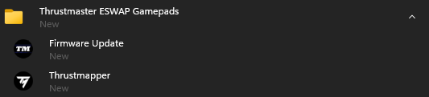
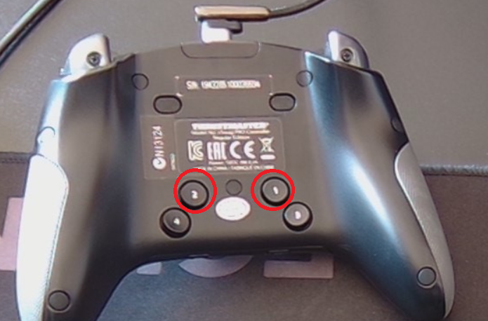
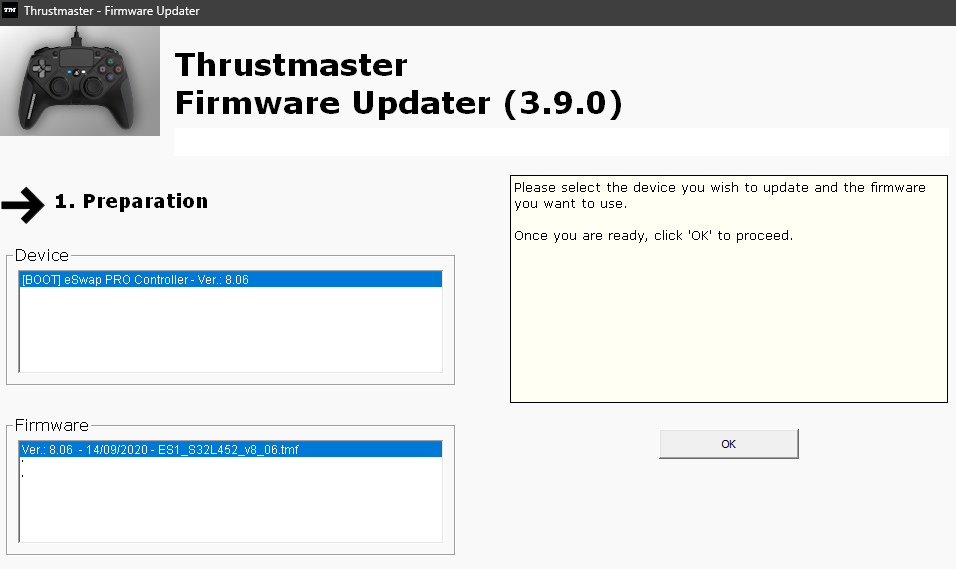

# How to access the bootloader mode on the Thrustmaster eSwap Pro (PS4)

1. Disconnect your eSwap Pro Controller
2. Open the Firmware Updater.  
  
3. Hold the back buttons 1 and 2 and while plugging in the controller into your computer  
  
4. Release the button, your controller will show up in "BOOT" mode on the firmware updater.  
  
